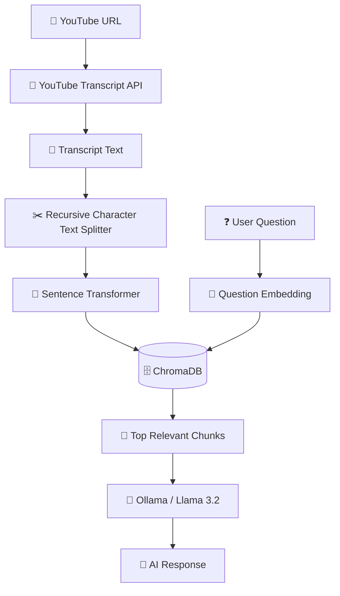

<div align="center">

# 🎬 Tube AI API

### Ask questions about YouTube videos without watching the entire video.

<p>
  <strong>YouTube → Transcript → Chunks → Embeddings → ChromaDB → RAG → Llama 3.2</strong>
</p>

<br>


<br>


</div>

---

## ✨ What is Tube AI?

**Tube AI API** is a Retrieval-Augmented Generation (RAG) backend that allows users to ask natural-language questions about YouTube videos.

Instead of watching a long video from beginning to end:

```text
🎥 YouTube Video
       │
       ▼
📝 Transcript Extraction
       │
       ▼
✂️ Text Chunking
       │
       ▼
🧠 Sentence Transformer
       │
       ▼
🗄️ ChromaDB
       │
       ▼
🔎 Semantic Search
       │
       ▼
🤖 Llama 3.2
       │
       ▼
💬 AI Answer
```

The goal is simple:

> **Give Tube AI a YouTube video, then ask questions about it.**

---

## 🚀 Features

| Feature                      | Description                                              |
| ---------------------------- | -------------------------------------------------------- |
| 🎥 YouTube ingestion         | Extract transcripts from YouTube videos                  |
| 🌍 Multi-language transcript | Supports Hindi and English transcript lookup             |
| ✂️ Smart chunking            | Splits long transcripts into smaller chunks              |
| 🧠 Embeddings                | Converts text chunks into semantic vectors               |
| 🗄️ Vector database          | Stores embeddings in ChromaDB                            |
| 🔎 Semantic search           | Finds the most relevant chunks for a question            |
| 🤖 Local LLM                 | Uses Ollama with Llama 3.2                               |
| ⚡ Fast API                   | Built with FastAPI                                       |
| 🔐 Environment variables     | API keys/configuration can be stored outside source code |
| 📚 RAG pipeline              | Uses retrieved context before generating an answer       |

---

## 🧠 How RAG Works

Tube AI follows a two-stage pipeline.

### 1. 📥 Ingestion

When a YouTube URL is submitted:

```text
YouTube URL
     ↓
Video ID
     ↓
Transcript
     ↓
Text Chunks
     ↓
Embedding Model
     ↓
Vector Embeddings
     ↓
ChromaDB
```

Each video is stored in its own ChromaDB collection using the video ID.

For example:

```text
chroma_db/
│
├── video_abc123
│   ├── chunk_0
│   ├── chunk_1
│   └── chunk_2
│
└── video_xyz789
    ├── chunk_0
    ├── chunk_1
    └── chunk_2
```

### 2. 🔍 Question answering

When the user asks:

```text
"What did the speaker say about machine learning?"
```

Tube AI:

```text
User Question
      ↓
Question Embedding
      ↓
ChromaDB Similarity Search
      ↓
Top 3 Relevant Chunks
      ↓
Llama 3.2
      ↓
Final Answer
```

This prevents the LLM from having to process the entire transcript for every question.

---

# 🏗️ Architecture



---

# 🛠️ Tech Stack

<div align="center">

| Technology                      | Purpose                   |
| ------------------------------- | ------------------------- |
| 🐍 **Python**                   | Core programming language |
| ⚡ **FastAPI**                   | REST API framework        |
| 🎬 **YouTube Transcript API**   | Transcript extraction     |
| 🧩 **LangChain Text Splitters** | Transcript chunking       |
| 🤗 **Sentence Transformers**    | Text embeddings           |
| 🗄️ **ChromaDB**                | Vector database           |
| 🦙 **Ollama**                   | Local LLM runtime         |
| 🤖 **Llama 3.2**                | Answer generation         |
| 🔐 **python-dotenv**            | Environment configuration |

</div>

---

# 📂 Project Structure

```text
Tube-AI-API/
│
├── 📁 services/
│   ├── 📝 chunk_extractor.py
│   ├── 🧠 embadding.py
│   ├── 🔎 query.py
│   └── 🦙 ollama_connection.py
│
├── 🗄️ chroma_db/
│
├── 🚀 app.py
├── ⚙️ config.py
├── 🗃️ database.py
├── 📦 requirements.txt
├── 🔒 .env
├── 🚫 .gitignore
└── 📖 README.md
```

> **Note:** `.env`, `chroma_db/`, `.venv/`, and Python cache files should remain excluded from Git.

---

# ⚡ Quick Start

## 1️⃣ Clone the repository

```bash
git clone https://github.com/ytsubhadip/Tube-AI-API.git

cd Tube-AI-API
```

---

## 2️⃣ Create a virtual environment

### Windows

```powershell
python -m venv .venv

.venv\Scripts\activate
```

### Linux / macOS

```bash
python3 -m venv .venv

source .venv/bin/activate
```

---

## 3️⃣ Install dependencies

```bash
pip install -r requirements.txt
```

---

# 🔐 Environment Variables

Create a `.env` file in the project root:

```env
GOOGLE_API_KEY=your_google_api_key
HF_TOKEN=your_huggingface_token
```

### ⚠️ Never commit `.env`

Your `.gitignore` should contain:

```gitignore
.env
.venv/
__pycache__/
*.pyc
chroma_db/
```

**Never put API keys or access tokens directly inside Python source code.**

---

# 🦙 Install Ollama

Tube AI currently uses Ollama as the local LLM runtime.

Install Ollama and download the model:

```bash
ollama pull llama3.2
```

Then make sure Ollama is running before starting the API.

You can verify the model:

```bash
ollama list
```

You should see something similar to:

```text
NAME
llama3.2
```

---

# ▶️ Run the API

Start FastAPI with Uvicorn:

```bash
uvicorn app:app --reload
```

The API will be available at:

```text
http://127.0.0.1:8000
```

---

# 📚 Interactive API Documentation

FastAPI automatically generates interactive API documentation.

Open:

```text
http://127.0.0.1:8000/docs
```

You can test the endpoints directly from Swagger UI without writing a frontend.

---

# 🔌 API Endpoints

## 🏠 `GET /`

Health/welcome endpoint.

### Response

```json
{
  "message": "welcome Tube RAG API"
}
```

---

# 🎥 `POST /yourube_url`

> Ingest a YouTube video into the vector database.

### Request

```json
{
  "url": "https://www.youtube.com/watch?v=VIDEO_ID"
}
```

### What happens internally?

```text
URL
 ↓
Extract Video ID
 ↓
Fetch Transcript
 ↓
Split Transcript
 ↓
Generate Embeddings
 ↓
Create Chroma Collection
 ↓
Store Chunks
```

### Example response

```json
{
  "message": "✅ Data stored successfully!",
  "video_id": "VIDEO_ID"
}
```

---

# 💬 `POST /query`

Ask a question about an already-ingested video.

### Request

```json
{
  "query": "What is the main topic of this video?",
  "video_id": "VIDEO_ID"
}
```

### Internal flow

```text
Question
   ↓
Sentence Transformer
   ↓
Question Vector
   ↓
ChromaDB
   ↓
Top 3 Relevant Chunks
   ↓
Llama 3.2
   ↓
Answer
```

### Example response

```json
{
  "message": "The main topic of the video is..."
}
```

---

# 🧪 Example Workflow

### Step 1 — Add a video

```http
POST /yourube_url
```

```json
{
  "url": "https://www.youtube.com/watch?v=4JofSJIrjwU"
}
```

Response:

```json
{
  "message": "✅ Data stored successfully!",
  "video_id": "4JofSJIrjwU"
}
```

---

### Step 2 — Ask a question

```http
POST /query
```

```json
{
  "query": "What did the speaker explain about RAG?",
  "video_id": "4JofSJIrjwU"
}
```

Tube AI retrieves the most semantically relevant transcript chunks and sends those chunks to Llama 3.2.

---

# 🧩 Core Components

## 🎬 Transcript Extraction

`chunk_extractor.py`

Responsible for:

* Extracting the YouTube video ID
* Fetching transcript data
* Combining transcript segments
* Returning transcript text and video ID

---

## 🧠 Embedding Pipeline

`embadding.py`

The current embedding pipeline:

```text
Transcript
    ↓
RecursiveCharacterTextSplitter
    ↓
Chunks
    ↓
all-MiniLM-L6-v2
    ↓
Vectors
    ↓
ChromaDB
```

The project currently uses `all-MiniLM-L6-v2` for embeddings and stores the generated vectors and metadata in ChromaDB.

---

## 🗄️ Vector Database

Each video currently gets its own ChromaDB collection:

```python
collection = client.get_or_create_collection(
    name=f"{video_id}"
)
```

Each chunk receives an ID similar to:

```text
VIDEO_ID_chunk0
VIDEO_ID_chunk1
VIDEO_ID_chunk2
```

Metadata includes:

```json
{
  "video_id": "VIDEO_ID",
  "chunk_number": 0
}
```

---

## 🔎 Semantic Search

`query.py`

The user's question is converted into an embedding:

```python
query_embedding = model.encode(
    user_input
).tolist()
```

Then ChromaDB searches for the closest vectors:

```python
results = collection.query(
    query_embeddings=[query_embedding],
    n_results=3
)
```

The retrieved chunks become the context for the LLM.

---

# 🤖 LLM Pipeline

Tube AI uses:

```text
Ollama
   ↓
Llama 3.2
   ↓
Retrieved YouTube Context
   ↓
Natural Language Answer
```

The LLM is instructed to answer the user's question using the retrieved video context.

This allows the system to run the generation component locally instead of relying entirely on a hosted LLM API.

---

# 🧠 Why RAG?

Without RAG:

```text
Entire YouTube Transcript
          ↓
         LLM
          ↓
       Answer
```

With RAG:

```text
Entire Transcript
       ↓
    Chunks
       ↓
   Embeddings
       ↓
   Vector DB
       ↓
Relevant Chunks Only
       ↓
       LLM
       ↓
     Answer
```

### Benefits

* ⚡ Less irrelevant context
* 🎯 Better retrieval
* 🧠 More focused answers
* 💰 Potentially lower inference cost
* 📚 Scales better as transcripts become larger

---

# 🔮 Roadmap

* [x] 🎥 YouTube transcript extraction
* [x] ✂️ Text chunking
* [x] 🧠 Sentence Transformer embeddings
* [x] 🗄️ ChromaDB integration
* [x] 🔎 Vector similarity search
* [x] 🤖 Ollama integration
* [x] 🦙 Llama 3.2 integration
* [ ] 🌐 Deploy API to the cloud
* [ ] ☁️ Move ChromaDB from local storage to cloud
* [ ] 🔐 API authentication
* [ ] 🚦 Rate limiting
* [ ] 🧪 Automated tests
* [ ] 🐳 Docker support
* [ ] 📊 Better observability
* [ ] 💬 Streaming responses
* [ ] 🎨 Frontend chat interface
* [ ] 🌍 Improved multilingual support

---

# 🐳 Future Docker Architecture

The intended deployment architecture can eventually look like:

```text
                 🌐 Client
                    │
                    ▼
              ⚡ FastAPI
                    │
        ┌───────────┴───────────┐
        ▼                       ▼
   🗄️ Vector DB              🦙 Ollama
   ChromaDB                   Llama 3.2
        ▲                       │
        │                       │
        └────── RAG Context ────┘
                    │
                    ▼
              💬 AI Response
```

---

# 🛡️ Security

Never commit secrets.

### ❌ Don't do this

```python
HF_TOKEN = "hf_xxxxxxxxxxxxxxxxx"
```

### ✅ Use environment variables

```python
import os

HF_TOKEN = os.getenv("HF_TOKEN")
```

And keep credentials inside:

```text
.env
```

which should be ignored by Git.

---

# 🧪 Development

Run the development server:

```bash
uvicorn app:app --reload
```

Then visit:

```text
/docs
```

to interactively test the API.

---

# 📈 Project Status

> 🚧 **Active Development**

Tube AI API is currently a learning and development project focused on building a practical YouTube-based RAG system using modern AI infrastructure.

The architecture is intentionally modular so individual components can later be replaced or upgraded.

---

# 🤝 Contributing

Contributions, ideas, bug reports, and improvements are welcome.

```text
Fork
  ↓
Create Branch
  ↓
Make Changes
  ↓
Test
  ↓
Commit
  ↓
Pull Request 🚀
```

---

# ⭐ Support

If you find this project interesting:

⭐ Star the repository
🍴 Fork it
🐛 Open an issue
💡 Suggest an improvement
📖 Improve the documentation

Every contribution helps the project grow.

---

<div align="center">

## 🎬 Tube AI

### Turn long videos into searchable knowledge.

```text
WATCH LESS.
ASK MORE.
LEARN FASTER.
```

**Built with ❤️ using Python, FastAPI, ChromaDB, Hugging Face & Ollama.**

</div>
